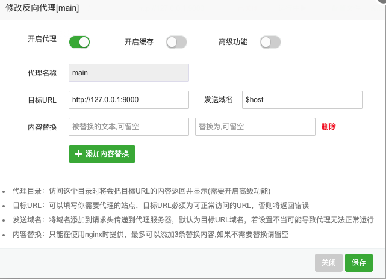

# Docker 图形化工具 Portainer

[GitHub 地址](https://github.com/portainer/portainer)

## 安装

- 下载Portainer的docker镜像

```sh
docker pull portainer/portainer
```

- 运行Portainer容器

```sh
docker run -p 9000:9000 -p 8000:8000 --name portainer \
--restart=always \
-v /var/run/docker.sock:/var/run/docker.sock \
-v /mydata/portainer/data:/data \
-d portainer/portainer
```

- 宝塔中使用方式

配置站点，配置反向代理  

