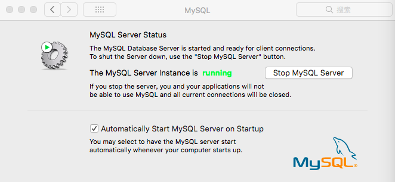

# MAC下使用mysql

- 输入指令 
```
cd /usr/local/mysql/bin
```
- 输入指令
```
sudo mysqld_safe --skip-grant-tables
```

正确的显示结果应该是这个样子,Mysql自动重启：
```
mysqld_safe Starting mysqld daemon with databases from /usr/local/mysql/data
```
- 再打开一个终端，设置mysql密码：  
```
mysql
mysql> FLUSH PRIVILEGES;
mysql> SET PASSWORD FOR 'root'@'localhost' = PASSWORD('admin123');
```

OK,大功告成！