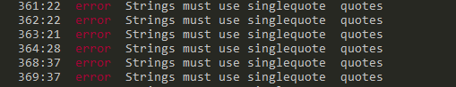
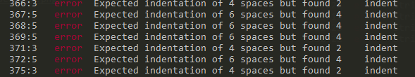
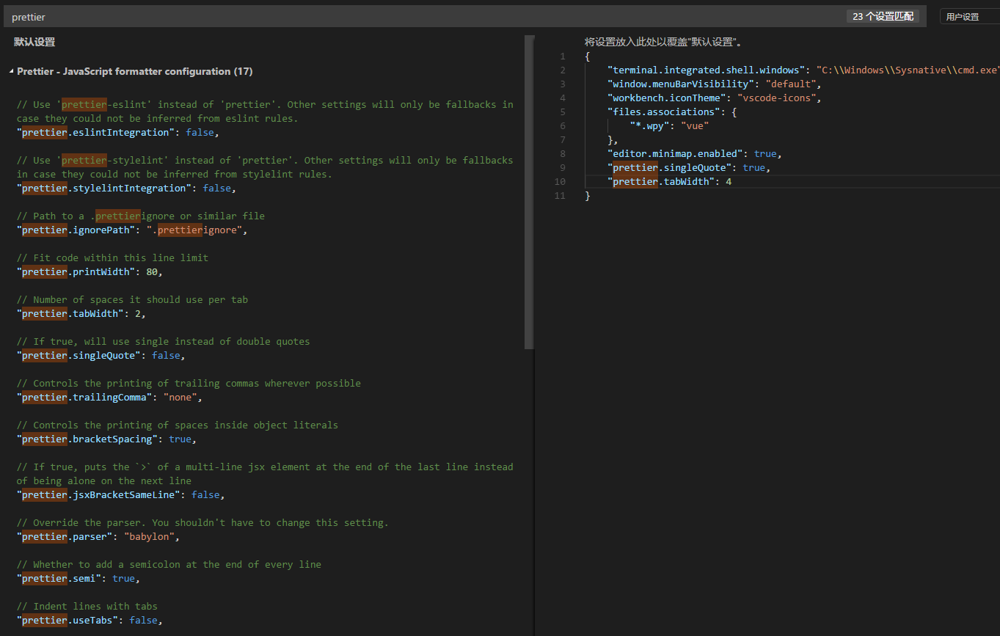

# vscode使用中的一些记录  

## 自定义格式化文件  
最近在使用vscode格式化代码的时候遇到一个代码规范的问题。导致eslint总数报错。  

  

解决办法：

> 1.在扩展中搜索 **formatter** 安装扩展Prettier  

> 2.在文件 -> 首选项 -> 设置中搜索 **prettier**  

* 可以参照左边的默认设置说明，修改 **"prettier.singleQuote": true,**,表示格式化的时候会默认把双引号格式化成单引号。

* 可以参照左边的默认设置说明，修改 **"prettier.tabWidth": 4**,表示默认每行缩进4个空格距离。