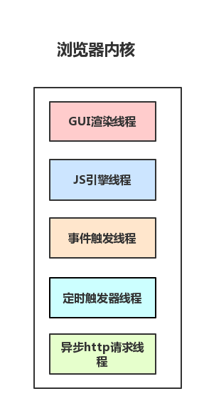

## 从输入URL到页面加载的过程的梳理

### 梳理主干流程

* 从浏览器接收url到开启网络请求线程（知识点：浏览器机制，进程，线程）
* 开启网络线程到发出一个完整的http请求（知识点：dns查询，tcp/ip请求，五层因特网协议栈）
* 从服务器接收到请求到对应后台接收到请求（知识点：载均衡，安全拦截以及后台内部的处理）
* 后台和前台的http交互（知识点：http头部、响应码、报文结构、cookie等知识，可以提下静态资源的cookie优化，以及编码解码，如gzip压缩）
* http的缓存（知识点：http缓存头部，etag，catch-control）
* 浏览器接收到http数据包后的解析流程（知识点：解析html-词法分析然后解析成dom树、解析css生成css规则树、合并成render树，然后layout、painting渲染、复合图层的合成、GPU绘制、外链资源的处理、loaded和domcontentloaded）
* CSS的可视化格式模型（知识点：元素的渲染规则，如包含块，控制框，BFC，IFC）
* JS引擎解析过程（知识点：JS的解释阶段，预处理阶段，执行阶段生成执行上下文，VO，作用域链、回收机制）
* 其它（知识点：跨域，web安全，hybird模式(小程序)）

#### 从浏览器接收url到开启网络请求线程
>多进程的浏览器

进程可能包括主控进程，插件进程，GPU，tab页（浏览器内核）等等。
* Browser进程：浏览器的主进程（负责协调、主控），只有一个
* 第三方插件进程：每种类型的插件对应一个进程，仅当使用该插件时才创建
* GPU进程：最多一个，用于3D绘制
* 浏览器渲染进程（内核）：默认每个Tab页面一个进程，互不影响，控制页面渲染，脚本执行，事件处理等（有时候会优化，如多个空白tab会合并成一个进程）

>多线程的浏览器内核

每一个tab页面可以看作是浏览器内核进程，然后这个进程是多线程的，它有几大类子线程：
* GUI线程
* JS引擎线程
* 事件触发线程
* 定时器线程
* 网络请求线程

如下图可以看到，里面的JS引擎是内核进程中的一个线程，这也是为什么常说JS引擎是单线程的。
