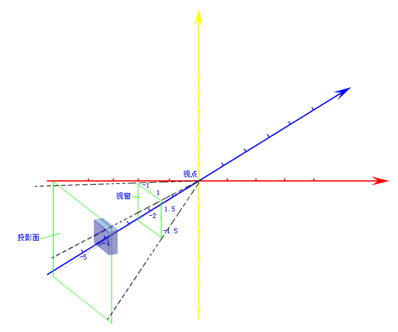
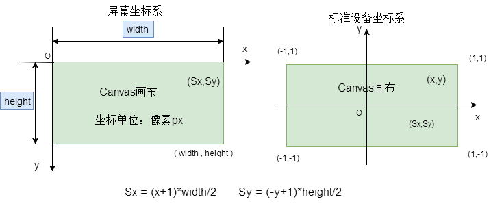
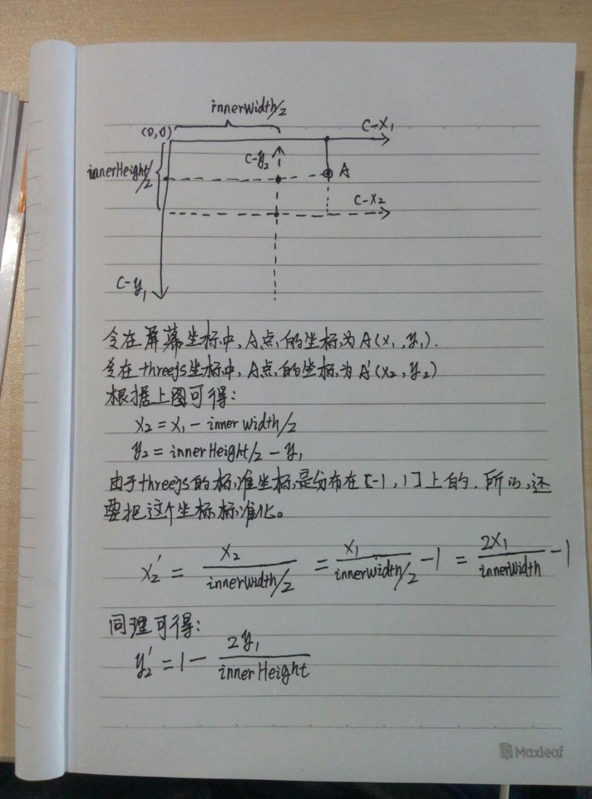
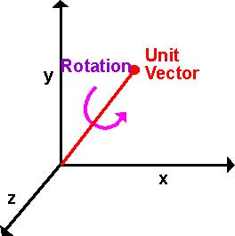

# [ThreeJs 点击与交互]()

##### 项目需求：

在页面中选中模型，然后选择模型现在在屏幕中间，然后用手指进行 360 度滑动，再次点击模型打开详情，点击关闭按钮回到原型原有的位置。

##### 思路：

选中模型 --> 选中模型移动到屏幕中心 --> 操作模型旋转 --> 打开详情 --> 回位

#### 选中模型

* 获取屏幕坐标的 x,y
  在 threejs 中，是通过 Raycaster 对象来拾取对象的，ray 是射线，caster 是投射器，从字面上即可理解其工作原理是：从某个方向发射一条射线，穿过鼠标所在的点，则这条射线经过的对象就是鼠标点击的对象。功能代码如下：

```
let raycaster = new THREE.Raycaster();
let mouse = new THREE.Vector2();
function onDocumentMouseDown(e){

      //将鼠标点击位置的屏幕坐标转成threejs中的标准坐标
       mouse.x = (e.clientX/window.innerWidth)*2 -1;  //鼠标的x到屏幕y的距离与屏幕宽的一半的比值 绝对值不超过1
       mouse.y = -(e.clientY/window.innerHeight)*2 + 1;  //鼠标的y到屏幕x轴的距离与屏幕宽的一半的比值 绝对值不超过1

       //从相机发射一条射线，经过鼠标点击位置
       raycaster.setFromCamera(mouse,camera);

       //计算射线相机到的对象，可能有多个对象，因此返回的是一个数组，按离相机远近排列
       let intersects = raycaster.intersectObjects(scene.children);
       for ( var i = 0; i < intersects.length; i++ ) {
           intersects[ i ].object.material.color.set( 0x00ff00 );
       }
 }
```

这里涉及到两个名词：世界坐标系和屏幕坐标系。

* 世界坐标系：在 webGL 中，世界坐标系是以屏幕中心为原点(0, 0, 0)，且是始终不变的。你面对屏幕，你的右边是 x 正轴，上面是 y 正轴，屏幕指向你的为 z 正轴。长度单位这样来定：窗口范围按此单位恰好是(-1,-1)到(1,1)，即屏幕左下角坐标为（-1，-1），右上角坐标为（1,1）。
* 屏幕坐标系：
  webGL 的重要功能之一就是将三维的世界坐标经过变换、投影等计算，最终算出它在显示设备上对应的位置，这个位置就称为设备坐标。在屏幕、打印机等设备上的坐标是二维坐标。

如图所示：  
  
所以世界坐标转化为屏幕坐标:  


推导过程(参考：https://teakki.com/p/58b3c122f0d40775548d7aee):


这个方法有一个问题：当物体的中心在另一个物体内部时，是不能够检测到碰撞的。而且当两个物体能够互相穿过，且有较大部分重合时，检测效果也不理想。

#### 选中模型移动到屏幕中心  
 想让选中模型移动到屏幕中心，有两种方式：  
 1. 物体移动到屏幕中心。
 2. 相机移动使观察物体处于屏幕中心。 
 经实验，第一种排除。选用第二种方式：  
 定义一个数组，设置好模型被选中后相机的x,y,z坐标，点击物体的时候把该值赋给相机，并保存相机之前的位置信息，方便后面还原。
 为了实现平滑过渡，可以使用[tween.js](https://github.com/tweenjs/tween.js).

 #### 操作模型旋转
 目前，我知道的3D中表现旋转有三种方法：矩阵、欧拉角、四元组.  
 ##### [四元组旋转思路](http://www.flowers1225.com/lessons/2016/02/29/1)：  
 首先四元数控制旋转需要的是一个旋转轴和一个旋转弧度，直接上图清楚明了  
 
 核心代码如下：
 ```
 function rotateMatrix(rotateStart, rotateEnd){
        var axis = new THREE.Vector3(),
            quaternion = new THREE.Quaternion();
            
        //得到开始和结束向量间的夹角    
        var angle = Math.acos(rotateStart.dot(rotateEnd) / rotateStart.length() / rotateEnd.length());

        if (angle){  //如果夹角等于0， 说明物体没有旋转
            axis.crossVectors(rotateStart, rotateEnd).normalize();  //rotateStart,rotateEnd向量乘积 标准化 得到旋转轴
            angle *= _that.rotationSpeed; //rotationSpeed旋转系数 得到旋转弧度
            quaternion.setFromAxisAngle(axis, angle);  //从一个旋转轴和旋转弧度得到四元组， 如果要让物体相反方向旋转 设置angle为负
        }
        return quaternion; //返回一个旋转的四元数
    }

 this.handleRotation = function(object){
        _that.rotateEndPoint = _that.projectOnTrackball(_that.deltaX, _that.deltaY);
        var rotateQuaternion = rotateMatrix(_that.rotateStartPoint, _that.rotateEndPoint);
        var curQuaternion = object.quaternion;
        curQuaternion.multiplyQuaternions(rotateQuaternion, curQuaternion); //设置四元组 a x b
        curQuaternion.normalize();
        object.setRotationFromQuaternion(curQuaternion);  //方法通过规范化的旋转四元数直接应用旋转  参数必须normalize()
   };
 ```

  #### 打开详情  
  打开一个详情页，这里的思路是：  
- 首先在载入模型的时候，把需要被选中的模型以及模型的名称分别加入到一个定义好的两个数组中。通过判断被选中的对象的名字是否为为模型的名字来确定选择的是哪个模型。  
- 接下来打开详情就是用html知识进行详情页的展示以及数据的动态加载更新。

  #### 回位  
  模型回位就是将之前在处理选中模型移动到屏幕中心时候保存的相机位置重新赋给相机，并通过tween.js让其平滑回位。
