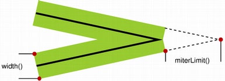

### miterLimit  
   
### 从画布坐标（100,100）的位置到（700,700）的位置画一条线的粗细是10，颜色是红色的线段
```
//状态设置
context.moveTo(100,100)  //笔尖移动
context.lineTo(700,700) //画线
context.lineWidth = 10
context.strokeStyle = “red”

//绘制
context.stroke()
```
### 画多边形  
需要注意：
1.填充颜色和画线的顺序不同结果也不同；
```
context.beginPath() // 多线段时每个线段都要调用一下这个方法

context.closePath()

//填充色和线条设置
context.fillStyle('yellow')
context.lineWidth = 10
context.strokeStyle = “red”

//设置
context.fill()
context.stroke()
```


### 画一个长方形

```
function Rectangle(cxt, x, y, width, height){
    cxt.moveTo( x , y );
    cxt.lineTo( x + width , y );
    cxt.lineTo( x + width , y + height );
    cxt.lineTo( x , y + height );

    cxt.rect( x , y , width , height );
}
```

### 画一个自动规划路径的长方形

```
function Rectangle(cxt, x, y, width, height){
   cxt.fillRect( x , y , width , height );
   cxt.strokeRect( x , y , width , height );
}
```

### lineCap  
只能用于线条的开始处和结尾处
```
square //方形的头
round //圆形的头
butt //默认的头
```

### lineJoin  
线条衔接处效果
```
bevel //斜接的角
round //圆形的头
miter //默认的尖角
```


### 渐变色
> createLinearGradient方法用来设置渐变色。

``` 
createLinearGradient方法的参数是(x1, y1, x2, y2)，其中x1和y1是起点坐标，x2和y2是终点坐标。通过不同的坐标值，可以生成从上至下、从左到右的渐变等等。
var myGradient = ctx.createLinearGradient(0, 0, 0, 160); 
myGradient.addColorStop(0, "#BABABA"); 
myGradient.addColorStop(1, "#636363");
```

### 设置阴影

```
ctx.shadowOffsetX = 10; // 设置水平位移
ctx.shadowOffsetY = 10; // 设置垂直位移
ctx.shadowBlur = 5; // 设置模糊度
ctx.shadowColor = "rgba(0,0,0,0.5)"; // 设置阴影颜色

ctx.fillStyle = "#CC0000"; 
ctx.fillRect(10,10,200,100);
```