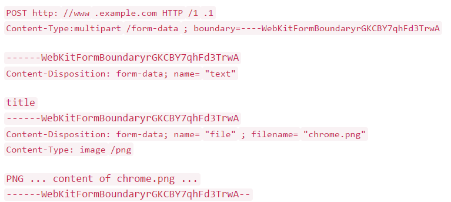

# 四种常见的 POST 提交数据方式

四种常见的post提交数据方式分别为：
```
- application/x-www-form-urlencoded
- multipart/form-data
- application/json
- text/xml
```  

首先协议规定 POST 提交的数据必须放在消息主体（entity-body）中，但协议并没有规定数据必须使用什么编码方式。实际上，开发者完全可以自己决定消息主体的格式，只要最后发送的 HTTP 请求满足上面的格式就可以。

## 一、最常见的POST提交数据方式  

### application/x-www-form-urlencoded

```
提交的数据按照 key1=val1&key2=val2 的方式进行编码，key 和 val 都进行了 URL 转码。大部分服务端语言都对这种方式有很好的支持。例如 PHP 中，$_POST['title'] 可以获取到 title 的值，$_POST['sub'] 可以得到 sub 数组。
很多时候，我们用 Ajax 提交数据时，也是使用这种方式。例如 JQuery 和 QWrap 的 Ajax，Content-Type 默认值都是「application/x-www-form-urlencoded;charset=utf-8」。
```

## 二、稍复杂点的POST提交方式  

### multipart/form-data

```
首先生成了一个 boundary 用于分割不同的字段，为了避免与正文内容重复，boundary 很长很复杂。然后 Content-Type 里指明了数据是以 mutipart/form-data 来编码，本次请求的 boundary 是什么内容。消息主体里按照字段个数又分为多个结构类似的部分，每部分都是以 --boundary 开始，紧接着内容描述信息，然后是回车，最后是字段具体内容（文本或二进制）。如果传输的是文件，还要包含文件名和文件类型信息。消息主体最后以 --boundary-- 标示结束。
```

## 三、JSON方式的POST提交

### application/json
  
```
可以方便的提交复杂的结构化数据，特别适合 RESTful 的接口。
但也有些服务端语言还没有支持这种方式，例如 php 就无法通过 $_POST 对象从上面的请求中获得内容。这时候，需要自己动手处理下：在请求头中 Content-Type 为 application/json 时，从 php://input 里获得原始输入流，再 json_decode 成对象。一些 php 框架已经开始这么做了。
```

## 四、 最臃肿的POST提交方式

### text/xml
  
```
XML-RPC 协议简单、功能够用，各种语言的实现都有。它的使用也很广泛，如 WordPress 的 XML-RPC Api，搜索引擎的 ping 服务等等。JavaScript 中，也有现成的库支持以这种方式进行数据交互，能很好的支持已有的 XML-RPC 服务。不过，我个人觉得 XML 结构还是过于臃肿，一般场景用 JSON 会更灵活方便。
```
